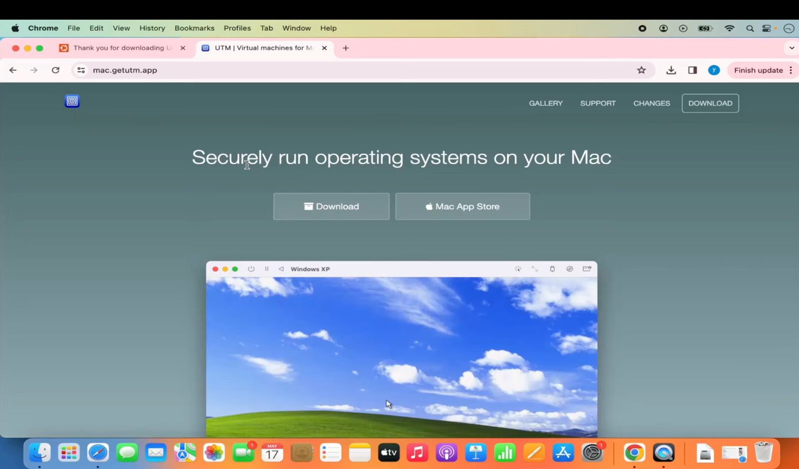
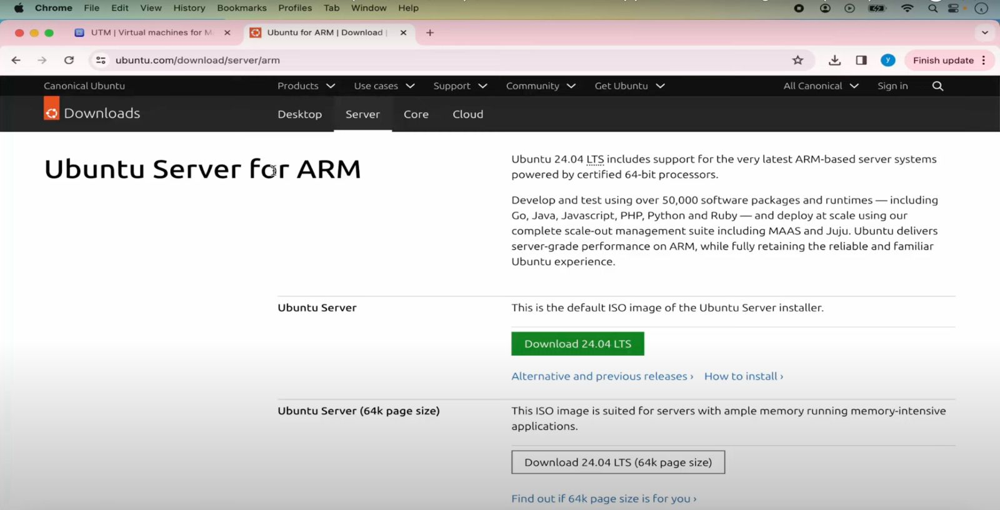
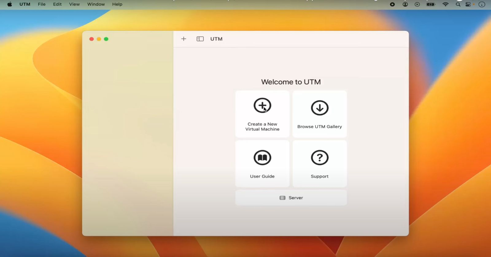
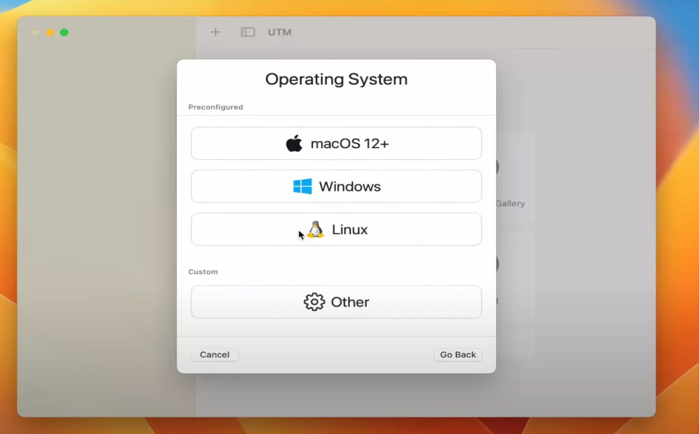
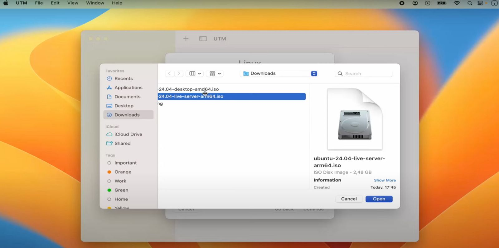
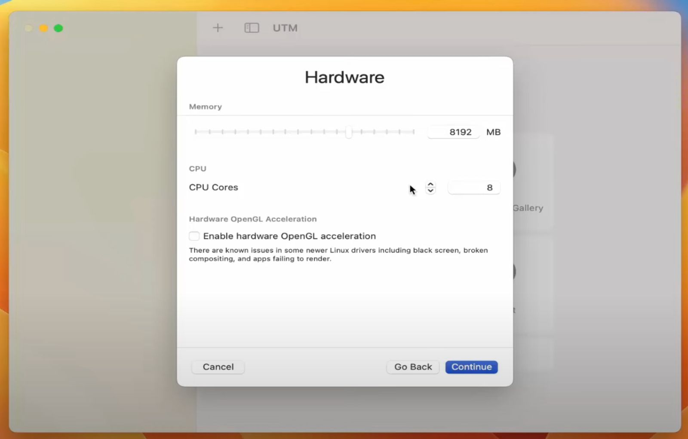
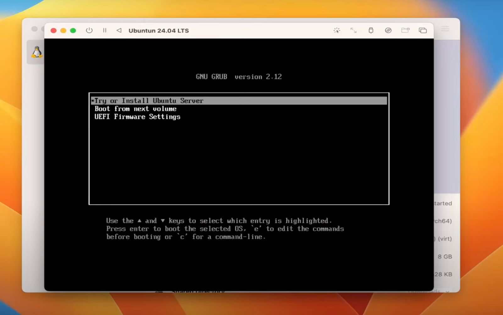
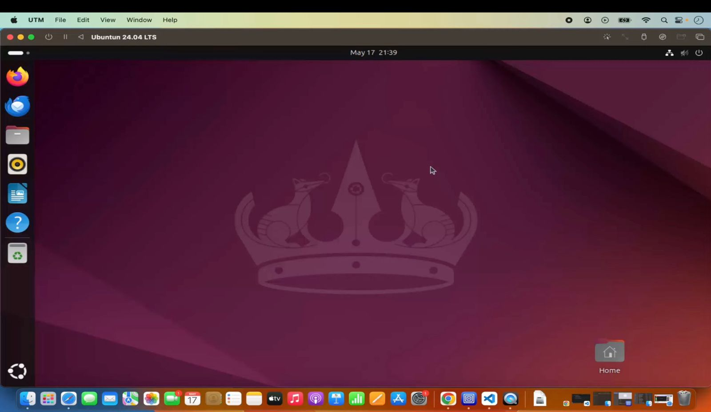

Hi, I am Md Aadil. This repository is to store my submissions for zairza Skill++ Cloud Computing Tasks & DevOps tasks.

1. Start by downloading and installing UTM from the official website.   

2. Download the Ubuntu ISO file. 

3. After installing UTM, open the application and click on “File” -> “New” to create a new virtual machine.	 

4. Choose “Linux” as the operating system and select Ubuntu 22.04.1 LTS (Jammy Jellyfish) as the distribution.	 

5. Select the Ubuntu ISO file and click “Start” to boot the virtual machine. 

6. Allocate sufficient RAM and CPU resources to the virtual machine according to your needs. 

7. Installation process. 

8. After installation setup GUI.
  *To Setup GUI:*
* sudo apt update
* sudo apt install tasksel
* sudo apt install ubuntu-desktop 

 
9. Install Guest Tools      
*To Install Guest Tools:*

* sudo apt install spice-vdagent
* sudo apt install spice-webdavd
