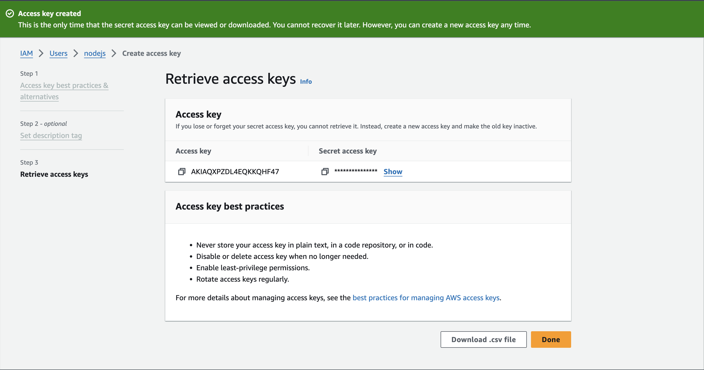
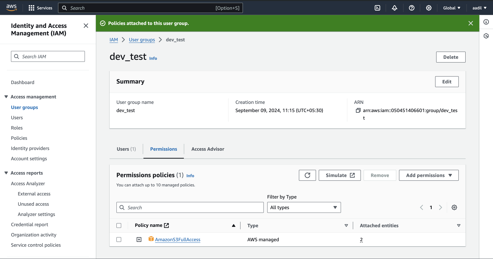
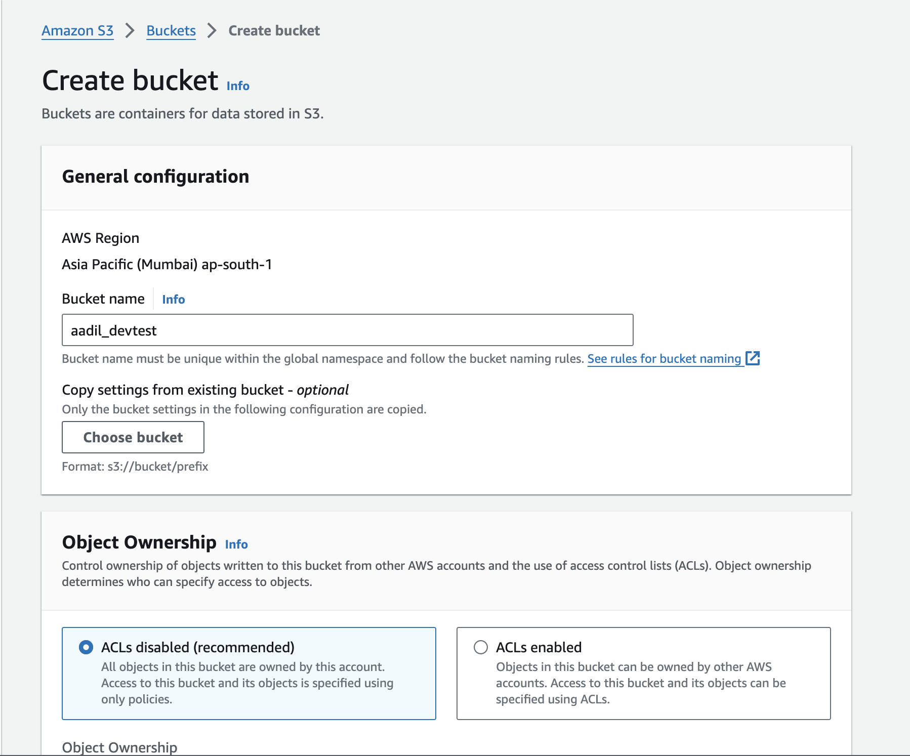
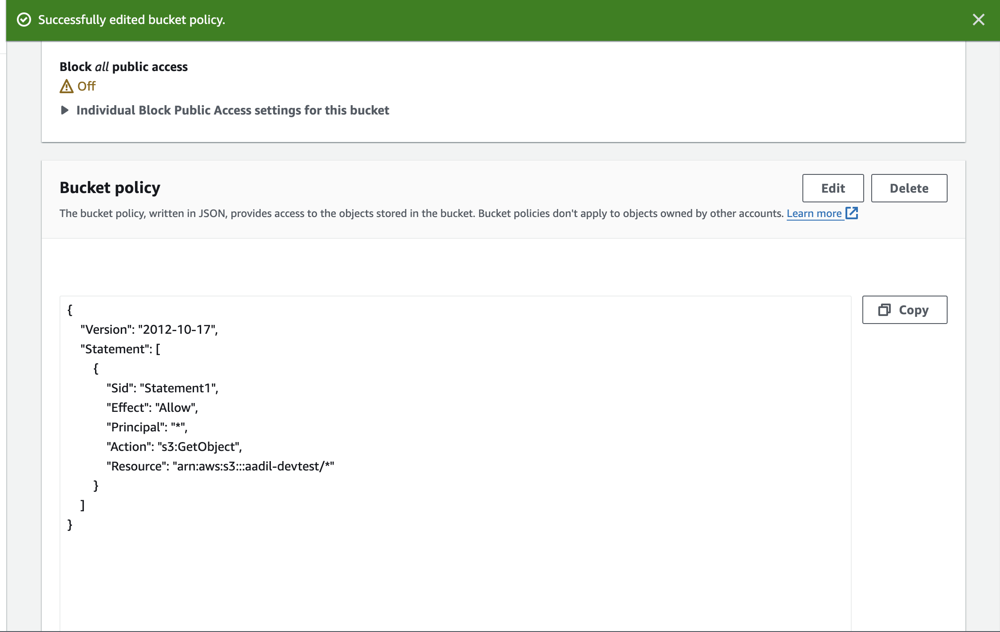
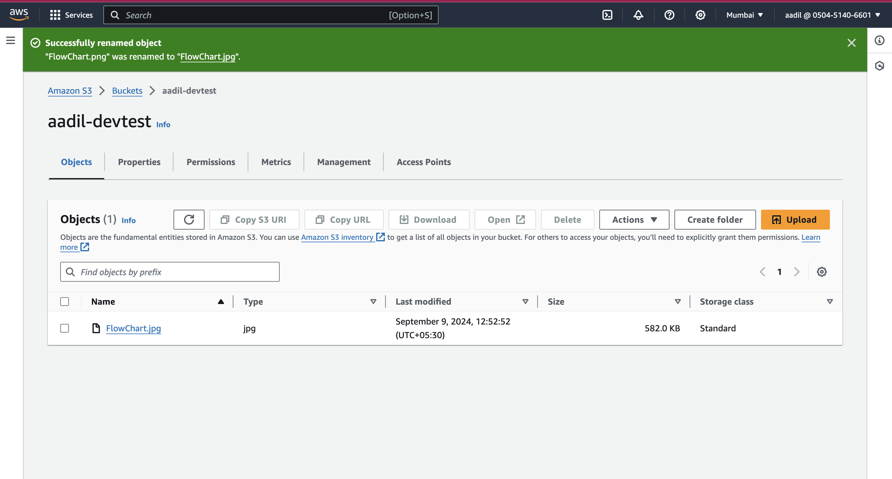
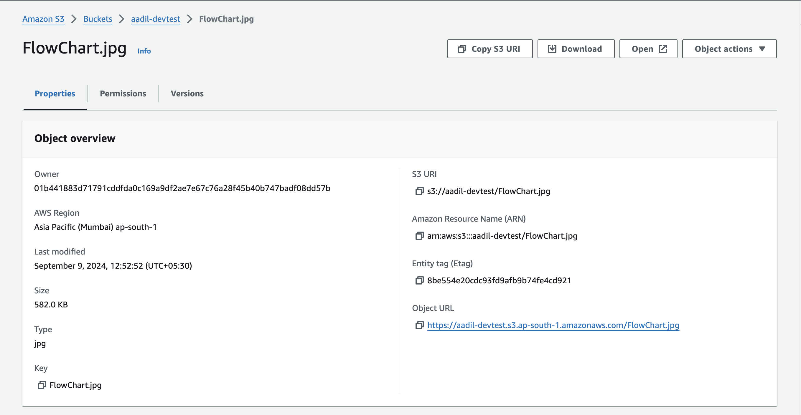
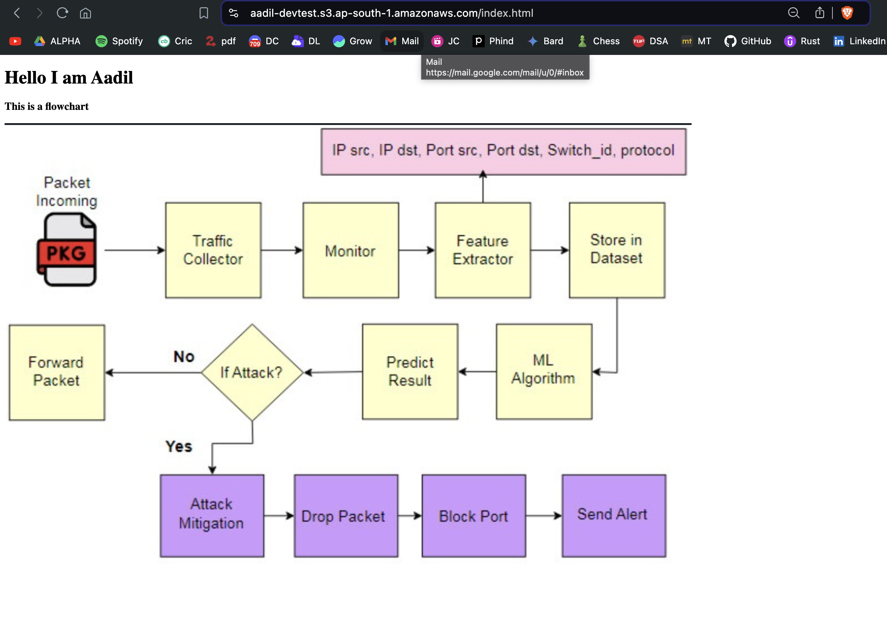
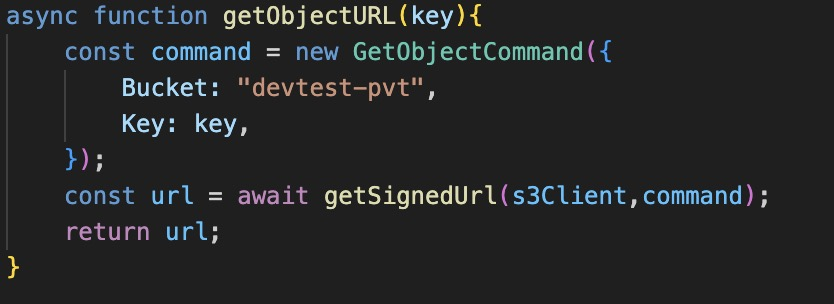
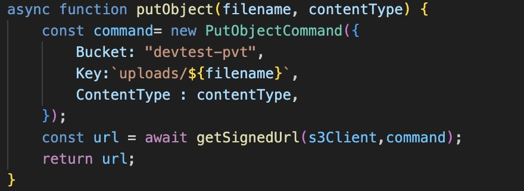
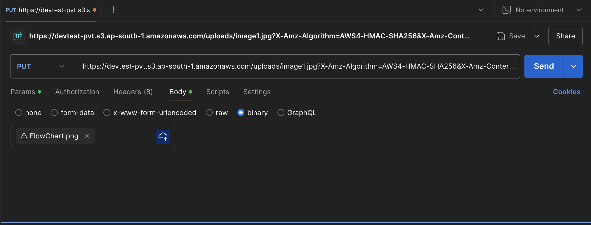

# WEEK 2 : Working with Buckets and AWS S3 SDK

### TASK 1.1: Creating a Bucket:
1. Logging into IAM Account
2. Creating access keys

2. Creating a user grp with S3 access
  
3. Creating a bucket with unique name     

4. Setting neccessary permissions for a bucket     

### Using console to upload Objects

5. Uploading the image
 
6. Accessing the image
 

### TASK 1.2: Hosting a static website on AWS
     
7. The website is now hosted      

Click Here for the Website: [link](https://aadil-devtest.s3.ap-south-1.amazonaws.com/index.html)

### TASK 2: Using AWS SDK to upload and download Objects

1. Downloading the image from the bucket using this code          
     
2. Uploading 
   
      
 